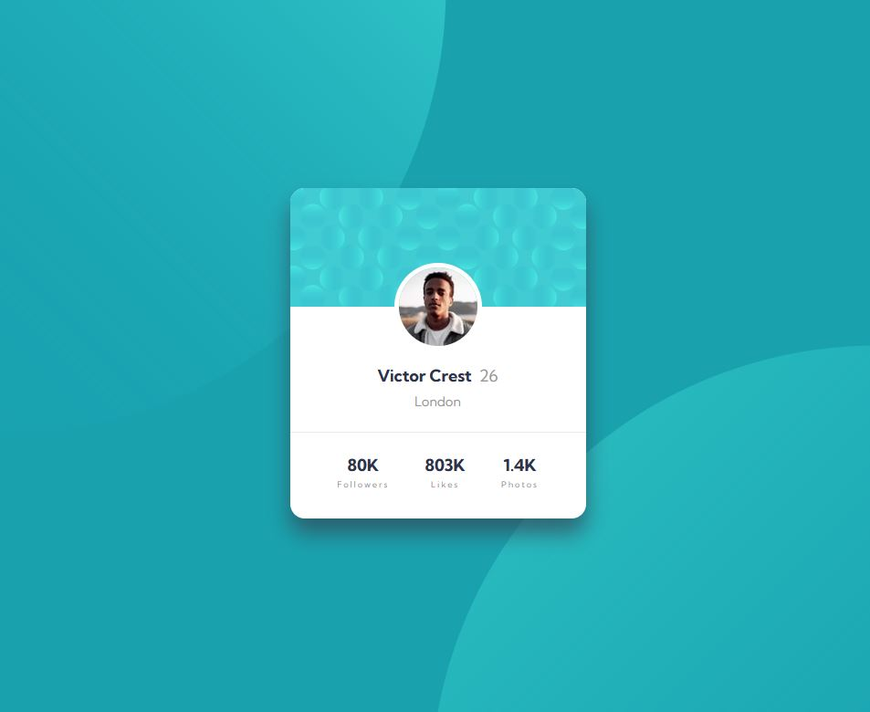

# Frontend Mentor - Profile card component solution

This is a solution to the [Profile card component challenge on Frontend Mentor](https://www.frontendmentor.io/challenges/profile-card-component-cfArpWshJ). Frontend Mentor challenges help you improve your coding skills by building realistic projects. 

## Table of contents

- [Overview](#overview)
  - [The challenge](#the-challenge)
  - [Screenshot](#screenshot)
  - [Links](#links)
- [My process](#my-process)
  - [Built with](#built-with)
  - [What I learned](#what-i-learned)
  - [Useful resources](#useful-resources)
- [Author](#author)


## Overview

### The challenge

- Build out the project to the designs provided

### Screenshot



### Links

- Solution URL: [Add solution URL here](https://your-solution-url.com)
- Live Site URL: [Add live site URL here](https://your-live-site-url.com)

## My process

### Built with

- Semantic HTML5 markup
- CSS custom properties
- Flexbox
- Mobile-first workflow

### What I learned

- Working with backgrounds is fun!
```css
body {
    height: 100vh;

    background-color: var(--cyan-600);
    margin: 0;
    font-family: var(--family);
    font-size: var(--fs-base);

    /* MULTIPLE BACGKROUNDS! */
    background-image: url("images/bg-pattern-top.svg"), url("images/bg-pattern-bottom.svg");
    /* Great background positioning! */
    background-position: calc(50% - 30rem) calc(50% - 25rem), calc(50% + 30rem) calc(50% + 30rem);
    background-repeat: no-repeat;
}
```

- Finally, fix for corrupted hr in `flex-direction: column` found (not without the help of [stackoverflow](https://stackoverflow.com/questions/34365271/hr-inside-container-with-display-flex-become-corrupted))

```css
.profile-card__hr {
    /* Marvellous! */
   margin: 1.5rem calc(-1 * var(--card-padding));
   align-self: stretch;

   border: 0;
   border-top: 1px solid var(--gray-200);
}
```

### Useful resources

- [w3schools](https://www.w3schools.com/css/css3_backgrounds.asp) - Told me how I do multiple backgrounds for one element.

## Author

- Frontend Mentor - [@Quakumei](https://www.frontendmentor.io/profile/Quakumei)
- Twitter - [@Quakumei](https://github.com/Quakumei)
